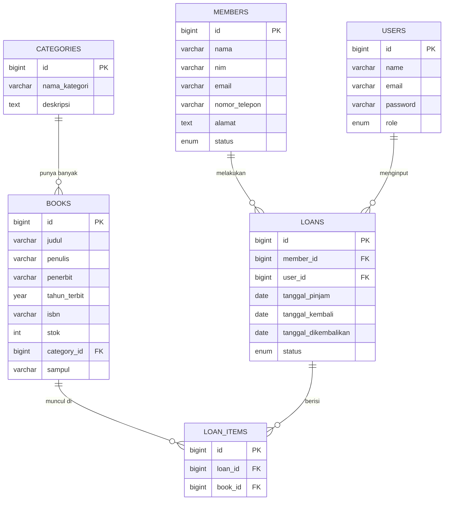

# Studi Kasus & Desain Database — Sistem Perpustakaan Digital Kampus

> Halaman ini adalah referensi tunggal untuk studi kasus dan desain database yang dipakai sepanjang modul, dari Pertemuan 1 sampai UAS. Baca ini kapan pun butuh mengingat kembali "gambaran besar" project — terutama sebelum Pertemuan 5 (Migration) dan Pertemuan 7 (Relationships), saat desain di halaman ini benar-benar diimplementasikan jadi kode.

---

## Tentang Aplikasi

**Sistem Perpustakaan Digital Kampus** adalah aplikasi manajemen perpustakaan yang dibangun bertahap sepanjang satu semester, satu-dua fitur per pertemuan, sampai menjadi satu aplikasi utuh di UAS.

**Aktor:**
- **Admin** — login, mengelola seluruh data, akses penuh
- **Petugas** — login, mengelola operasional harian (peminjaman, pengembalian)

**Fitur akhir yang akan dibangun:**
- Dashboard statistik (total buku, anggota, peminjaman aktif)
- CRUD Kategori Buku, CRUD Buku (dengan relasi kategori), CRUD Anggota
- Transaksi Peminjaman & Pengembalian Buku
- Autentikasi Petugas + proteksi route dengan Middleware
- REST API untuk data buku, anggota, dan peminjaman
- Halaman laporan yang mengonsumsi data dari API sendiri

Tidak semua ini langsung dibangun di awal. Tabel dan Model dibuat lengkap mulai Pertemuan 5, tapi relasi antar tabel baru benar-benar dipakai di kode mulai Pertemuan 7, dan autentikasi baru masuk di Pertemuan 8. Kalau kamu baca bagian relasi di bawah dan bingung "kok belum kepakai di kode", itu wajar — memang belum saatnya.

---

## Desain Tabel

Enam tabel berikut adalah seluruh skema database aplikasi ini. Legenda notasi yang dipakai di tiap tabel:

| Notasi | Arti |
|---|---|
| **PK** | Primary Key — kolom identitas unik tiap baris |
| **FK → nama_tabel** | Foreign Key — merujuk ke `id` di tabel lain |
| *nullable* | Kolom ini boleh kosong (`NULL`) |
| *default: x* | Nilai otomatis kalau tidak diisi saat insert |

### `users` — Akun Petugas/Admin

| Kolom | Tipe Data | Keterangan |
|---|---|---|
| id | BIGINT UNSIGNED | **PK** |
| name | VARCHAR(100) | Nama petugas/admin |
| email | VARCHAR(100) | Email, unik |
| password | VARCHAR(255) | Password (hashed bcrypt) |
| role | ENUM('admin','petugas') | *default: 'petugas'* |
| created_at, updated_at | TIMESTAMP | Otomatis dikelola Laravel |

Tabel ini dipakai untuk login, **bukan** untuk data anggota perpustakaan — jangan tertukar dengan tabel `members` di bawah. Kolom `role` yang membedakan admin dari petugas biasa baru benar-benar dipakai untuk membatasi akses mulai Pertemuan 8 (Middleware).

### `categories` — Kategori Buku

| Kolom | Tipe Data | Keterangan |
|---|---|---|
| id | BIGINT UNSIGNED | **PK** |
| nama_kategori | VARCHAR(100) | Contoh: "Fiksi", "Teknologi" |
| deskripsi | TEXT | *nullable* |
| created_at, updated_at | TIMESTAMP | Otomatis |

Tabel paling sederhana di seluruh skema — sengaja dijadikan tabel pertama yang di-CRUD lengkap di Pertemuan 5 karena tidak punya foreign key sama sekali, cocok untuk latihan Eloquent dasar sebelum masuk ke tabel yang lebih kompleks.

### `books` — Data Buku

| Kolom | Tipe Data | Keterangan |
|---|---|---|
| id | BIGINT UNSIGNED | **PK** |
| judul | VARCHAR(200) | |
| penulis | VARCHAR(100) | |
| penerbit | VARCHAR(100) | |
| tahun_terbit | YEAR | |
| isbn | VARCHAR(20) | Unik, *nullable* (tidak semua buku lama punya ISBN) |
| stok | INT | *default: 1* |
| category_id | BIGINT UNSIGNED | **FK → categories** |
| sampul | VARCHAR(255) | Path file gambar sampul, *nullable* |
| created_at, updated_at | TIMESTAMP | Otomatis |

Satu buku hanya boleh punya satu kategori (`category_id` tunggal) — kalau suatu saat butuh satu buku punya banyak kategori sekaligus, desainnya harus berubah jadi tabel pivot Many-to-Many. Skema saat ini sengaja disederhanakan jadi One-to-Many karena cukup untuk kebutuhan studi kasus ini.

### `members` — Anggota Perpustakaan

| Kolom | Tipe Data | Keterangan |
|---|---|---|
| id | BIGINT UNSIGNED | **PK** |
| nama | VARCHAR(100) | |
| nim | VARCHAR(20) | Unik |
| email | VARCHAR(100) | Unik |
| nomor_telepon | VARCHAR(15) | |
| alamat | TEXT | |
| status | ENUM('aktif','nonaktif') | *default: 'aktif'* |
| created_at, updated_at | TIMESTAMP | Otomatis |

Anggota perpustakaan (mahasiswa yang meminjam buku) — beda dari `users` (petugas yang login mengelola sistem). Status `nonaktif` dipakai untuk anggota yang misalnya sudah lulus, tanpa perlu menghapus riwayat peminjamannya.

### `loans` — Transaksi Peminjaman

| Kolom | Tipe Data | Keterangan |
|---|---|---|
| id | BIGINT UNSIGNED | **PK** |
| member_id | BIGINT UNSIGNED | **FK → members** — siapa yang meminjam |
| user_id | BIGINT UNSIGNED | **FK → users** — petugas yang menginput transaksi |
| tanggal_pinjam | DATE | |
| tanggal_kembali | DATE | Tanggal rencana/jatuh tempo pengembalian |
| tanggal_dikembalikan | DATE | Tanggal aktual dikembalikan, *nullable* (kosong selama masih dipinjam) |
| status | ENUM('dipinjam','dikembalikan','terlambat') | *default: 'dipinjam'* |
| created_at, updated_at | TIMESTAMP | Otomatis |

Satu baris `loans` mewakili **satu transaksi peminjaman**, bukan satu buku. Kalau satu anggota meminjam tiga buku sekaligus dalam satu kunjungan, itu tetap satu baris `loans` — daftar buku apa saja yang dipinjam dicatat di tabel `loan_items` di bawah, bukan di tabel ini.

### `loan_items` — Detail Buku per Transaksi

| Kolom | Tipe Data | Keterangan |
|---|---|---|
| id | BIGINT UNSIGNED | **PK** |
| loan_id | BIGINT UNSIGNED | **FK → loans** |
| book_id | BIGINT UNSIGNED | **FK → books** |
| created_at, updated_at | TIMESTAMP | Otomatis |

Ini tabel penghubung (*junction table*) yang membuat satu transaksi peminjaman (`loans`) bisa berisi banyak buku sekaligus (`books`) — pola Many-to-Many yang direalisasikan lewat dua relasi One-to-Many. Lihat penjelasan lebih lanjut di bagian "Kenapa `loan_items` Perlu Tabel Sendiri?" di bawah.

---

## Relasi Antar Tabel

### Diagram ER



> Diagram ini otomatis tampil sebagai gambar kalau dibuka di GitHub (mendukung Mermaid secara native). Kalau dibuka di editor teks biasa, kode di atas tetap bisa dibaca manual mengikuti pola `TABEL_A ||--o{ TABEL_B` = "satu `TABEL_A` punya banyak `TABEL_B`".

### Ringkasan Relasi (Teks)

```
categories ──────< books          One-to-Many  (1 kategori punya banyak buku)
users ───────────< loans          One-to-Many  (1 petugas menginput banyak transaksi)
members ─────────< loans          One-to-Many  (1 anggota punya banyak peminjaman)
loans ───────────< loan_items     One-to-Many  (1 transaksi punya banyak item buku)
books ───────────< loan_items     One-to-Many  (1 buku bisa muncul di banyak transaksi)
```

Tanda `<` menunjuk ke arah "banyak" — misalnya `categories ──< books` dibaca "satu kategori punya banyak buku, satu buku hanya milik satu kategori".

### Kenapa `loan_items` Perlu Tabel Sendiri?

Ini pertanyaan yang wajar muncul: kenapa tidak langsung taruh `book_id` di tabel `loans` saja? Jawabannya karena satu transaksi peminjaman bisa berisi **lebih dari satu buku** — dan satu kolom (`book_id`) di `loans` hanya bisa menyimpan satu nilai per baris. Kalau dipaksakan satu kolom, satu-satunya cara menampung banyak buku adalah membuat baris `loans` baru untuk tiap buku, padahal secara bisnis itu tetap **satu transaksi, satu kali kunjungan**, bukan beberapa transaksi terpisah.

`loan_items` menyelesaikan ini dengan pola yang disebut **relasi Many-to-Many lewat tabel perantara**: satu `loans` bisa berelasi ke banyak `loan_items`, dan tiap `loan_items` menunjuk ke satu `books`. Hasilnya, satu transaksi peminjaman bisa mencatat berapa pun jumlah buku, masing-masing sebagai baris terpisah di `loan_items`, tanpa mengubah struktur `loans` itu sendiri. Pola ini sangat umum dipakai di luar studi kasus ini juga — keranjang belanja e-commerce (`orders` + `order_items`) atau invoice (`invoices` + `invoice_items`) memakai logika struktural yang identik.

### Definisi Eloquent Relationship (per Model)

Kode ini **belum ditulis** di Model manapun sampai Pertemuan 7 — ditampilkan di sini sebagai referensi supaya kamu tahu ke mana arah project ini menuju, bukan sebagai langkah praktikum yang harus diikuti sekarang.

```php
// Model: Category
public function books(): HasMany
{
    return $this->hasMany(Book::class);
}

// Model: Book
public function category(): BelongsTo
{
    return $this->belongsTo(Category::class);
}
public function loanItems(): HasMany
{
    return $this->hasMany(LoanItem::class);
}

// Model: Member
public function loans(): HasMany
{
    return $this->hasMany(Loan::class);
}

// Model: User
public function loans(): HasMany
{
    return $this->hasMany(Loan::class);
}

// Model: Loan
public function member(): BelongsTo
{
    return $this->belongsTo(Member::class);
}
public function user(): BelongsTo
{
    return $this->belongsTo(User::class);
}
public function loanItems(): HasMany
{
    return $this->hasMany(LoanItem::class);
}

// Model: LoanItem
public function loan(): BelongsTo
{
    return $this->belongsTo(Loan::class);
}
public function book(): BelongsTo
{
    return $this->belongsTo(Book::class);
}
```

Pola penamaan method-nya konsisten: sisi yang menyimpan foreign key (misalnya `books.category_id`) memakai `belongsTo()` — "buku ini **milik** satu kategori" — sedangkan sisi sebaliknya memakai `hasMany()` — "kategori ini **punya banyak** buku". Arah `belongsTo` selalu dari tabel yang punya kolom FK, mengarah ke tabel yang dirujuk.

---

## Progres Implementasi per Pertemuan

Supaya jelas kapan tiap bagian desain ini benar-benar jadi kode:

| Pertemuan | Yang terjadi ke desain ini |
|---|---|
| 1–4 | Belum ada tabel/Model sama sekali — Controller masih pakai array dummy |
| 5 | Semua 6 tabel dibuat lewat migration, semua Model dibuat dengan `$fillable`. CRUD `books` & `categories` pakai data nyata. **Relasi belum dipakai** — kolom FK seperti `category_id` masih tampil sebagai angka mentah di tampilan |
| 7 | Method `hasMany()`/`belongsTo()` di atas baru ditulis. Tampilan mulai menampilkan nama kategori (bukan ID), CRUD `loans` dibangun memakai relasi ke `members`, `users`, dan `loan_items` |
| 8 | Kolom `role` di `users` mulai dipakai membatasi akses lewat Middleware |

---

*Referensi lain: [Daftar Isi Modul](./README.md)*
